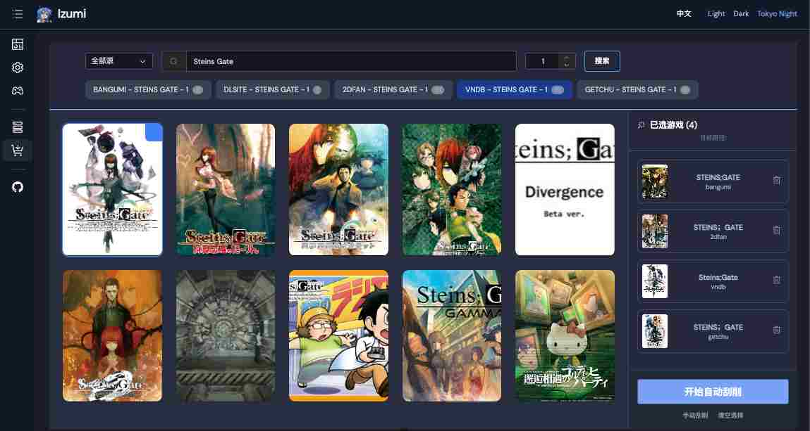
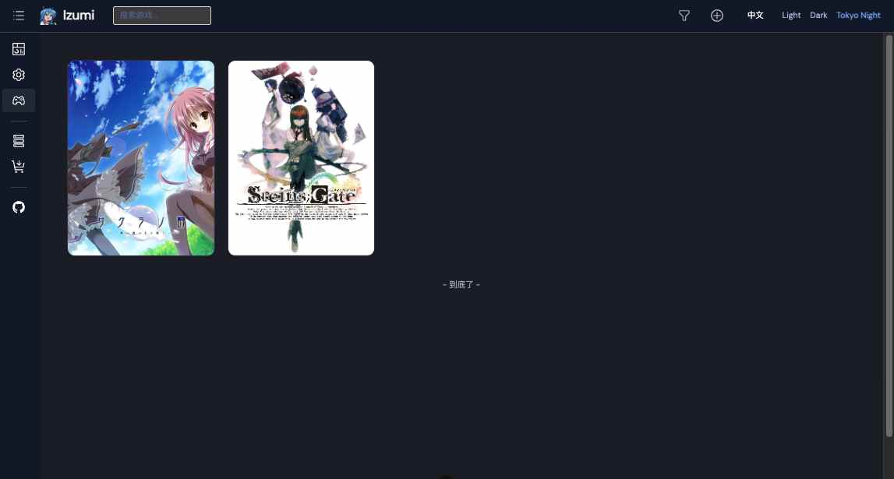
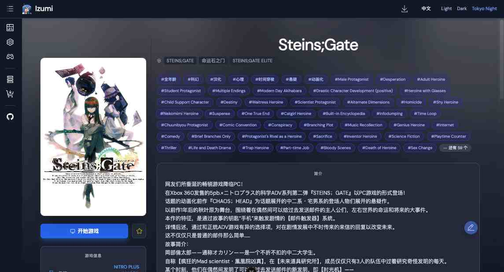
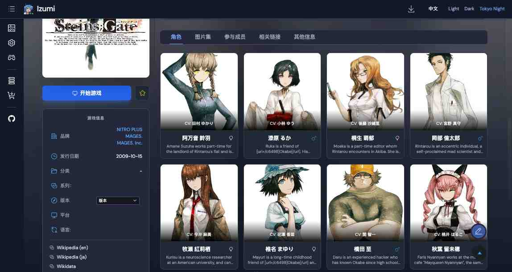

# Izumi

<p align="center">
  
</p>

<p align="center">
<strong>Izumi</strong> 是一个跨平台、功能丰富的游戏元数据爬虫与管理服务，旨在帮助你更轻松地整理与管理本地游戏库的元数据。
</p>

<p align="center">
  
</p>

---

## ✨ 功能特性

### 🧩 内置 6 个强大的元数据爬虫（Scraper）
Izumi 默认支持多个主流游戏站点，无需额外配置即可使用：

- **Bangumi**
- **DLsite**
- **Getchu**
- **2DFan**
- **GGBases**
- **VNDB**

### 📦 丰富的元数据支持
可获取并管理以下信息：

- 标签 / 分类  
- 品牌 / 发行商  
- 角色信息  
- 基本资料与扩展属性  
- 更多元数据视站点而定

### 🔁 本地游戏库集成
- 自动将刮削到的元数据保存到游戏目录  
- 支持从游戏目录自动导入已存在的元数据  

### 🔍 搜索功能
支持在站点与本地数据中快速搜索。

---

## 📸 截图展示

<p align="center">
  
</p>

<p align="center">
  
</p>

<p align="center">
  
</p>

---

## 🚧 TODO

- [ ] 实现 Dashboard 面板（当前为假数据）
- [ ] 增加英文语言支持

---

## 🚀 安装与启动

### Linux & macOS

```sh
git clone git@github.com:dokidokikoi/izumi.git
cd izumi
docker-compose build
docker-compose up -d
```

启动后访问：
👉 http://localhost:8080
